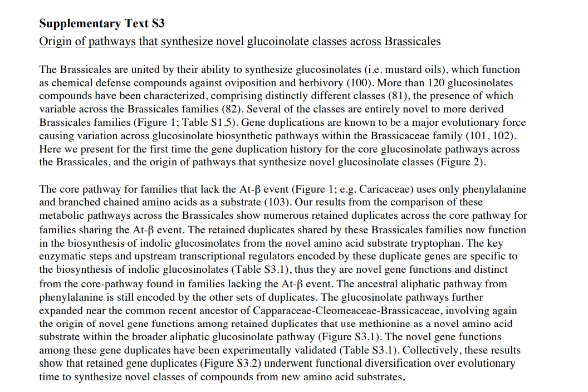
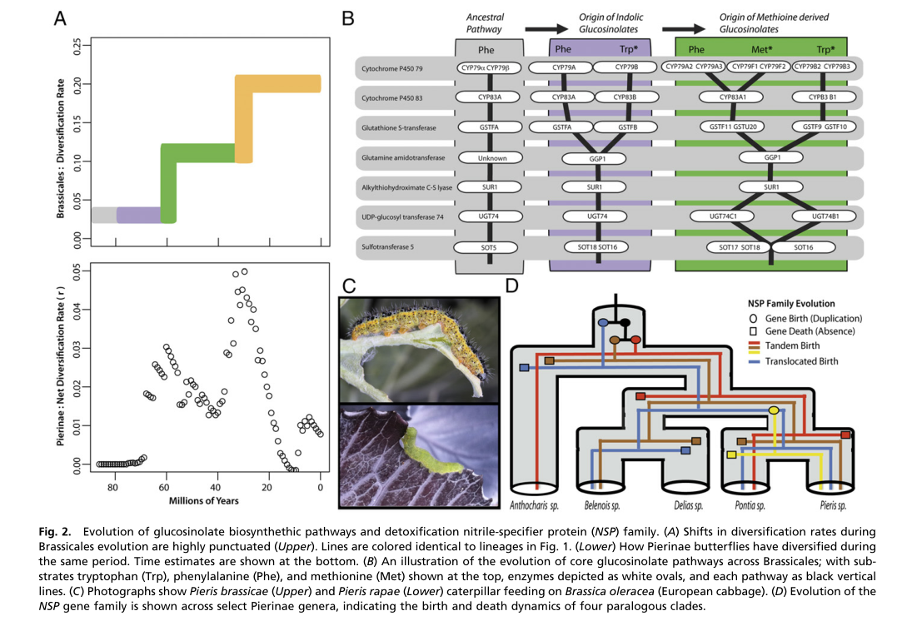

  最近一直在研究一类文章 网络进化和 代谢途径的关系，今天终于看出来它的一点思路，记录待察。

这篇文章的亮点是研究 蝴蝶和植物（大白菜）之间的斗争。大白菜不想让蝴蝶的幼虫吃，蝴蝶的幼虫还得吃，两者互相比赛，你打我，我打你。

我最想知道怎么研究这个路径的，后来是通过比较代谢途径，找到核心途径，之后结合基因复制事件保留的基因做的。

这一点不知道茶树可不可以做得到，否则真是一篇好文章。

