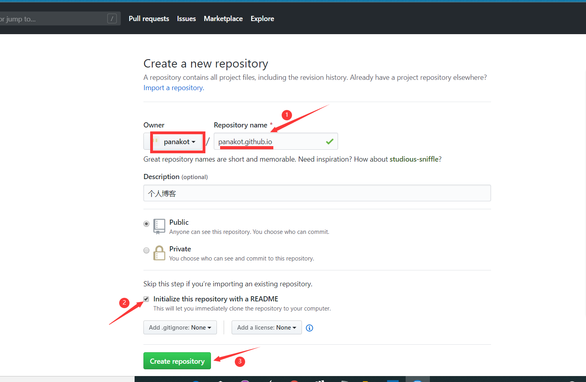
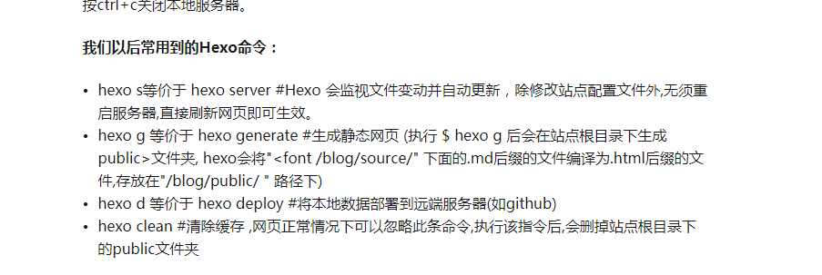

参考链接:  http://mucanyiio.com/2020/02/18/1/

​            https://zhuanlan.zhihu.com/p/111614119


Warning: 不太适合新手观看，只是记下来自己以后用

##### 目标： 最方便的建立自己的博客

##### 准备软件：

git （之前已经安装好）

hexo （博客框架）

node.js （web服务器端 Java 运行环境）


node.js 是在官网下载的

hexo  ： 命令行安装 

npm 是集中管理 Java 包的地方，类似 anaconda 

新建文件夹 Hexo

```linux
npm  install -g  hexo
hexo  init
npm install 
hexo server  
# 这一步会自动建立一个实例博客 Hello World
hexo clean  
hexo generate 
```

在[http://localhost:4000](http://baixin.io/2015/08/HEXO搭建个人博客/就可以看到最原始的效果了)就可以看到自己的本地的界面了

使用 命令

```
hexo new "My New Post" # 就可以创建自己的新文章
```


为了托管自己的博客在 github上，在github上新建项目，但是这个项目有自己的命名规则

一定要这样：



这时候 修改配置_config.yml  文件最后一段

```
    # Deployment
    ## Docs: https://hexo.io/docs/deployment.html
    deploy:
      type:
```

改为

```
# Deployment
## Docs: https://hexo.io/docs/deployment.html
deploy:
  type: git
  repository: git@github.com:Jinke233/Jinke233.github.io.git
  branch: master
```

##### 写文章、发文章 

```
   npm i hexo-deployer-git  #安装扩展
   hexo new post "article title"
```

编辑完 文章之后， hexo g 生成静态网页， hexo s 本地预览效果 , hexo d 上传到 github上.


常用命令：



终于有了自己的博客哈哈哈！